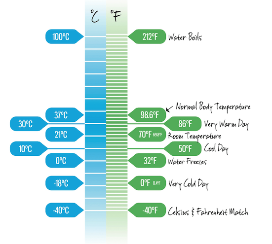

### Ex1:

names = ["Alex", "Beth", "Caroline", "Dave", "Eleanor","Freddie"]

import random

student_scores = {student:random.randint(1,100) for student in names}

passed_students = {student:score for (student, score) in student_scores.items() if score >= 60}

### Dictionary Comprehension 1

You are going to use Dictionary Comprehension to create a dictionary called result that takes each word in the given sentence and calculates the number of letters in each word.   

Try Googling to find out how to convert a sentence into a list of words.  *

*Do NOT** Create a dictionary directly.

Try to use Dictionary Comprehension instead of a Loop. 

To keep this exercise simple, count any punctuation following a word with no whitespace as part of the word. Note that "Swallow?" therefore has a length of 8.

`sentence = "What is the Airspeed Velocity of an Unladen Swallow?"

result = {word:len(word) for word in sentence.split()}

print(result)`

### Dictionary Comprehension 2

You are going to use Dictionary Comprehension to create a dictionary called weather_f that takes each temperature in degrees Celsius and converts it into degrees Fahrenheit.

To convert temp_c into temp_f use this formula:
(temp_c * 9/5) + 32 = temp_f

Celsius to Fahrenheit chart

**Do NOT** Create a dictionary directly. Try to use Dictionary Comprehension instead of a Loop.   

`weather_c = {"Monday": 12, "Tuesday": 14, "Wednesday": 15, "Thursday": 14, "Friday": 21, "Saturday": 22, "Sunday": 24}

weather_f = {dayofw:(temp_c * 9/5) + 32 for (dayofw, temp_c) in weather_c.items()}

print(weather_f)`

